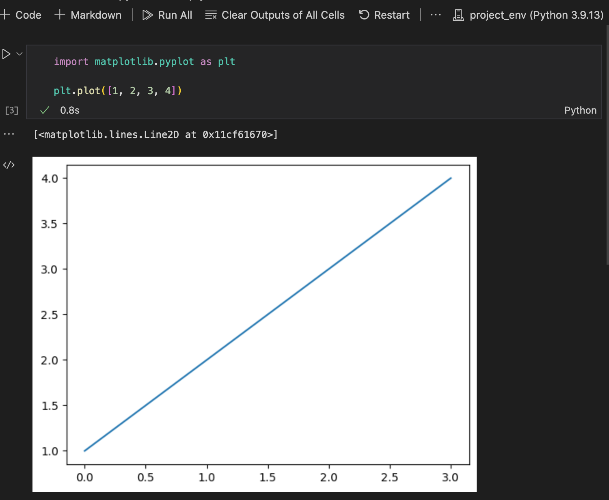

Remote development
==================

In machine learning and scientific computing applications, you may find yourself in a situation where you need to develop and deploy code on a remote machine.
This may limit your ability to visualize results as your interaction with the remote machine is typically limited to the command line.
One way to get around this is to use a interactive development environment (IDE) that allows you to run code on a remote machine.
With Visual Studio (VS) Code, you can use the `Remote - SSH <https://marketplace.visualstudio.com/items?itemName=ms-vscode-remote.remote-ssh>`__ extension to connect to a remote machine and develop code on it.

`This page <https://marketplace.visualstudio.com/items?itemName=ms-vscode-remote.remote-ssh>`__ gives you pretty much everything you need to setup remote development with VS Code, most notably `connecting to a remote host <https://code.visualstudio.com/docs/remote/ssh#_connect-to-a-remote-host>`__.

Using Jupyter notebooks to visualize plots
------------------------------------------

Running Jupyter notebooks on a remote machine through VS Code allows you to conveniently visualize results.

First, be sure to install the ``ipykernel`` package in your virtual environment (on the remote machine).

.. code-block:: bash

    pip install ipykernel

When opening your notebook, select your virtual environment.

Running long scripts
--------------------

When you close an SSH connection, the process running on the remote machine is killed.
If you would like to run a long script on a remote machine, there are several command line tools that let you run a script even after logging out:

* `screen <https://linuxize.com/post/how-to-use-linux-screen/>`__ (Linux or `WSL <https://learn.microsoft.com/en-us/windows/wsl/install>`__ for Windows).
* `tmux <https://www.hamvocke.com/blog/a-quick-and-easy-guide-to-tmux/>`__ (Linux, WSL, and macOS).
* `nohup <https://www.geeksforgeeks.org/nohup-command-in-linux-with-examples/>`__ (Linux or WSL).
